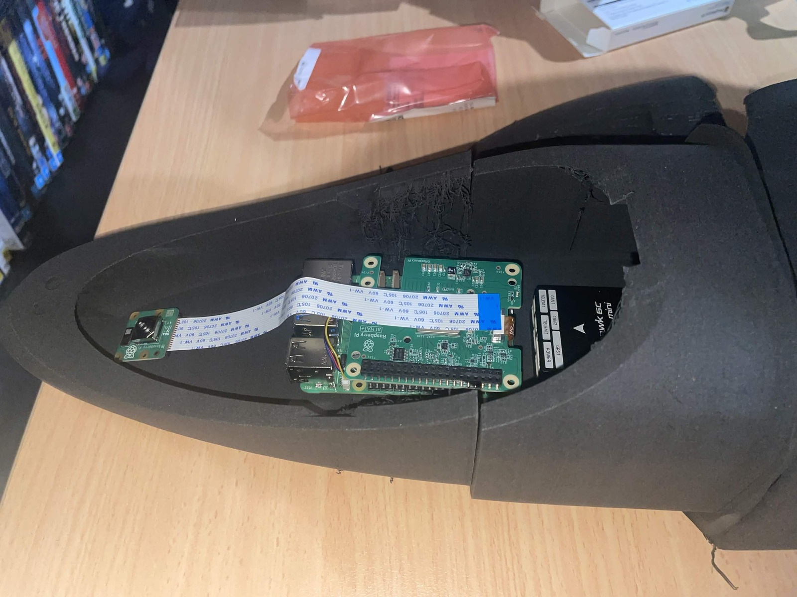
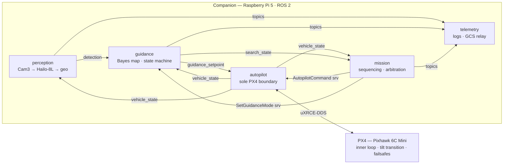
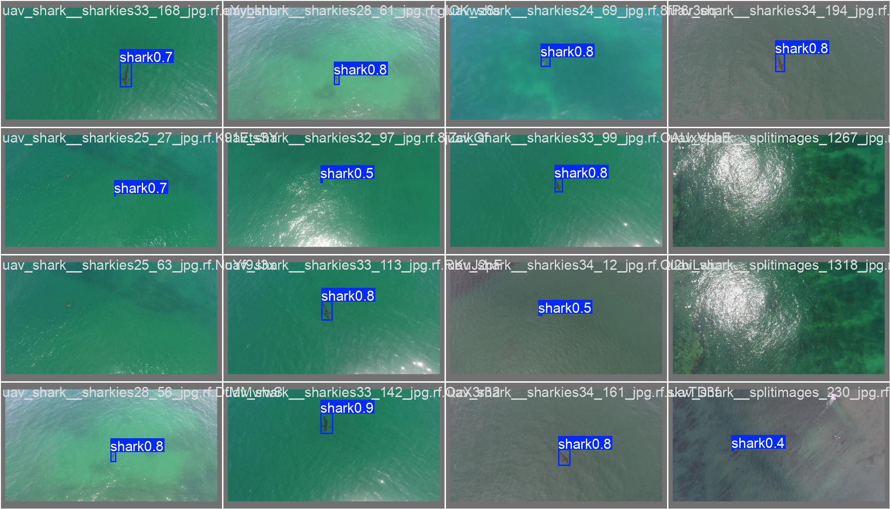
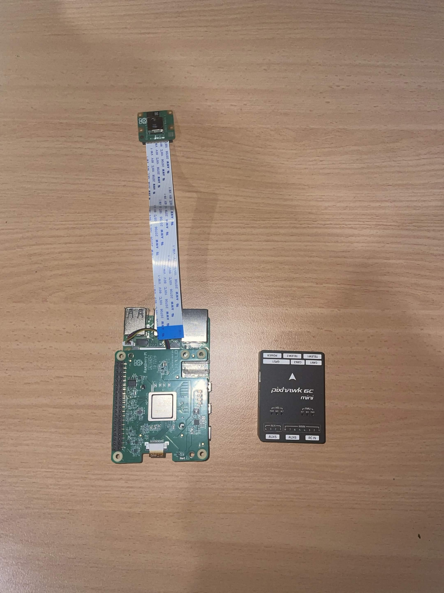

# Shark-ISR VTOL — Detection-Gated Guidance Autonomy

> **The aircraft transitions SEARCH → TRACK on its own.**
> A ROS 2 guidance state machine flies a tri-tiltrotor VTOL, gated on onboard detection
> confidence — no video downlink in the decision loop, no operator watching a screen.
> The application is shark monitoring; the engineering is persistent ISR autonomy.



*Raspberry Pi 5 + AI HAT+ (Hailo-8L) + Camera Module 3 + Pixhawk 6C Mini, installed inside the
Titan Dynamics Hornet fuselage. Camera faces down through the nose aperture.*

---

## The contribution

Small drones can already fly search patterns. The gap this project targets is the **decision**:

**01 — Persistent coverage**
The swim zone is covered by a threat-weighted persistent patrol with a hard revisit bound, so no
water goes stale. Probability re-grows as a target could move in, so guidance returns instead of
chasing one greedy peak. Coverage, not a one-shot find. Implemented and unit-tested (ADR-012);
the SITL campaign verified the boustrophedon coverage baseline (T10) — the patrol strategy's own
SITL re-run is the next gate.

**02 — Confidence-gated transition**
Detections accumulate confidence across frames and decay on misses. Only a sustained crossing of
threshold τ triggers the autonomous SEARCH → TRACK transition and orbit-on-detect. One lucky frame
never flies the aircraft. Implemented in guidance (ADR-016) and unit-tested; T11 verified the
detection→TRACK chain single-shot — re-run with the gate is the next SITL check.

**03 — Onboard, link-independent**
The detector (YOLOv8n compiled to a Hailo `.hef`) runs on a 13-TOPS NPU on the aircraft. Losing
every radio link costs situational awareness — never autonomy.

---

## Architecture



**The responsibility boundary is the design.**

| Layer | Owns |
|---|---|
| **PX4** | Inner loop, the tilt transition, every failsafe. ROS 2 can only *ask*. |
| **ROS 2** | Mission, guidance, perception, telemetry. Seven interfaces (4 msg, 3 srv), frames + units explicit, frozen before any node was written (ENU/FLU everywhere; all NED↔ENU conversion in one package). |

The companion computer is architecturally incapable of overriding a failsafe. Its total failure
degrades to an autopilot-handled RTL.

---

## Detector

YOLOv8n fine-tuned on 3,261 aerial images from four Roboflow datasets, compiled to a Hailo `.hef`
that runs on the onboard 13-TOPS NPU. Performance scored on **223 held-out images the model never
saw**, including 51 open-water hard negatives.

| Metric | Score | Condition |
|---|---|---|
| mAP50 | **0.945** | Held-out test set |
| mAP50-95 | **0.742** | Held-out test set |
| Recall | **95%** | Mission metric |
| Precision | **89%** | Hard-negative set |

**Recall is the mission metric.** For persistent aerial ISR, missing a detection is the
operational failure — the shark goes unlogged, the patrol wasted. 95% recall means the system
finds 19 of every 20 real targets. An 89% precision rate means ~1-in-9 detections is a false
positive; in ISR the cost is a second orbit — minor, recoverable.


*Model predictions on held-out validation frames. Sharks correctly flagged at 0.4–0.9 confidence;
open-water and reef patches correctly ignored.*

### Why this number is honest

The initial pipeline reported mAP50 **0.987** — a number that failed a plausibility check.
Investigation found the merge script had pooled source-level train and val sets, shuffled, and
re-split 90/10, scattering Roboflow augmentation siblings across both sides. ~67% of the val set
shared a source image with train. The merge pipeline was rewritten with a **group-disjoint split**
(siblings and video clips grouped by source, entire groups on one side only) and a held-out test
split added alongside open-water negatives. The model was retrained from scratch. Val ≈ Test
(0.949 vs 0.945) confirms it generalises.

### Compile pipeline

`.pt` → `.onnx` (opset 11, fixed batch) → `.har` (Hailo parse) → INT8 (64-img calibration) → **`.hef`**  
9 MB · hailo8l arch · 3-context · DFL decode + NMS on Pi 5 CPU · 0.45 threshold · 640 px · 10 Hz target

*On-device SITL (Hailo hardware in the loop) is the next gate — throughput unmeasured until then.*

---

## Hardware stack


*The four boards. Camera → Hailo-8L NPU → Raspberry Pi 5 companion → Pixhawk 6C Mini autopilot
(uXRCE-DDS). Total avionics mass fits the 2.5 kg MTOW ceiling with margin.*

| Board | Role |
|---|---|
| Raspberry Pi 5 | Companion computer — runs ROS 2, hosts all autonomy nodes |
| AI HAT+ (Hailo-8L, 13 TOPS) | Runs the compiled `.hef` detector at ≤ 10 Hz |
| Camera Module 3 | Downward-facing, libcamera/picamera2 pipeline |
| Pixhawk 6C Mini | Autopilot — PX4, owns inner loop + failsafes |

---

## Status

| Phase | Scope | State |
|---|---|---|
| 1 | Interface contract — 6 interfaces, frames + units | ✅ Frozen 2026-05-31 |
| 2 | PX4 SITL + Gazebo coastal world + DDS bridge | 🔶 World + launcher done; DDS gate pending |
| 3 | Autopilot bridge (sole PX4 boundary, uXRCE-DDS) | ✅ SITL ✓ — T06 orbit · T07 failsafe |
| 4 | Guidance — Bayesian map, search, orbit-on-detect | ✅ SITL ✓ — T10 search + track transition |
| 5 | Perception — Cam3 → Hailo detector → geolocation | ✅ SITL ✓ — T11 pipeline end-to-end |
| 6 | Mission — state machine, failsafes | ✅ SITL ✓ — T08 abort · T09 battery · T10 e2e |
| 7 | Telemetry — JSONL logs, GCS relay | 🔶 Code complete; SITL rehearsal pending |
| 8 | Hardware bring-up, mass/power budget, flight test | ⬜ Planned (post-budget) |

All seven packages build green (`colcon` 8/8 on ROS 2 Humble). **65/65 unit tests pass.**
A full-stack code review (ADR-011) caught and fixed 2 safety-critical + 6 high-severity bugs
before any sim run — validating the SITL-first rule.

---

## SITL verification

SITL runs the real ROS 2 nodes against a simulated PX4 autopilot and Gazebo Harmonic world.
It is the project's release gate: **no code reaches the aircraft until it has passed in SITL.**
T01–T05 (DDS bridge, arming, takeoff, loiter) passed in a prior campaign. T06–T11 cover the full
mission stack. *2026-07-13: the confidence gate (ADR-016) and persistent-patrol strategy (ADR-012)
are now wired into guidance — T10/T11 re-run with the new behaviours is the next SITL gate before
those two claims count as sim-verified.*

| Test | Proves | Evidence |
|---|---|---|
| **T06** — Orbit geometry | Bridge holds a precise 30 m circular orbit | 20/20 setpoints on circle (min=max=mean=30.00 m) |
| **T07** — Companion failsafe | If companion stops streaming, PX4 takes the aircraft back | Offboard loss → PX4 exits OFFBOARD in 5.1 s (COM_OF_LOSS_T) |
| **T08** — Operator abort | Operator can abort; aircraft returns home under autopilot | CMD_ABORT drove PX4 to nav_state RTL |
| **T09** — Low-battery failsafe | Low battery auto-triggers return before aircraft is stranded | Threshold crossing → mission RETURNING (tuneable live via ROS 2 param) |
| **T10** — End-to-end mission | Full state machine runs start-to-finish without intervention | All 5 phases visited IDLE→TRANSIT→SEARCH→TRACK→RETURN in 7.0 s |
| **T11** — Perception → TRACK | The real camera→detector→guidance chain makes the SEARCH→TRACK decision itself | mock_camera_node → detector_node → /detection → guidance TRACK in 3.2 s; ≥1 Detection confirmed |

```bash
./sim/tests/run_tests.sh          # PX4 SITL + Gazebo Harmonic + ROS 2 Humble
```

---

## Repo map

| Path | What |
|---|---|
| `ros2_ws/` | ROS 2 workspace — 7 packages, builds green (colcon 8/8 on Humble) |
| `ros2_ws/src/shark_isr_interfaces/` | 4 msg + 3 srv — the interface contract |
| `ros2_ws/src/shark_isr_autopilot/` | Sole PX4 boundary (uXRCE-DDS); NED↔ENU here only |
| `ros2_ws/src/shark_isr_perception/` | Cam3 → Hailo-8L → geolocation node |
| `ros2_ws/src/shark_isr_guidance/` | Bayesian map + search pattern + orbit-on-detect |
| `ros2_ws/src/shark_isr_mission/` | State machine, failsafe arbitration |
| `ros2_ws/src/shark_isr_telemetry/` | JSONL logging + GCS relay |
| `ros2_ws/src/shark_isr_bringup/` | Single-file stack launcher (`sitl.launch.py`) |
| `sim/tests/` | SITL test suite (T01–T11); run via `run_tests.sh` |
| `training/` | YOLOv8n pipeline — download → merge → train → ONNX → Hailo `.hef` |
| `training/runs/detect/` | Training artifacts: curves, confusion matrix, detection previews |
| `docs/` | Architecture, decisions (ADR-001–015), build plan, platform reference |

---

## Engineering principles

1. One ROS 2 package = one responsibility; modules talk only through `shark_isr_interfaces`.
2. Energy is the binding resource — MTOW 2.5 kg hard ceiling, best-L/D loiter bias.
3. Frames + units explicit on every message; parameters in YAML, never hardcoded.
4. Everything logged — flight, detections, decisions — so any incident is reconstructable.
5. No code reaches the aircraft until it has passed in SITL.
6. The companion computer is never in the safety-critical loop.

---

## Platform

Titan Dynamics Hornet, 1.1 m tri-tiltrotor VTOL (3D-printed LW-PLA). Vendor manual figures cited
in `docs/HORNET_PLATFORM.md` — the manual itself is not redistributed here (vendor copyright);
available from [Titan Dynamics](https://www.titandynamics.org/3dhangar/p/titan-hornet-vtol).

---

## Author

**Ryan H.** — Electrical & Aerospace Engineering, QUT (Nov 2026)

[GitHub](https://github.com/RyanH281-UAV) · [LinkedIn](https://www.linkedin.com/in/ryan-hughes-b272873a9/)

<sub>MIT licensed (code & original docs). No flight data is presented as real prior to flight test.</sub>
