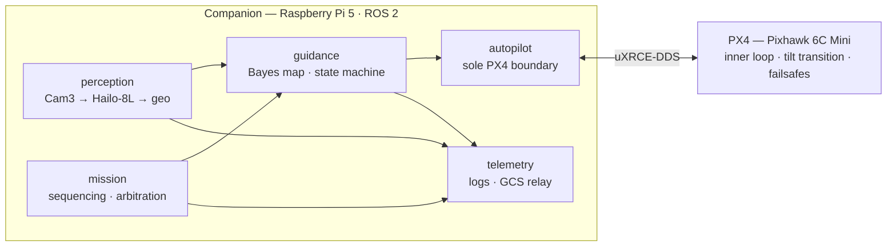

# Shark-ISR VTOL — Detection-Gated Guidance Autonomy

> An autonomous maritime-patrol stack: a ROS 2 guidance state machine that transitions a
> tri-tiltrotor VTOL from **SEARCH to TRACK on its own**, gated on onboard detection confidence —
> no video downlink in the decision loop, no operator watching a screen.
> The application is shark monitoring; the engineering is persistent ISR autonomy.

**Live:**
&nbsp;[Portfolio site](https://YOUR-USERNAME.github.io/shark-isr-vtol/) — includes an in-browser
simulation of the autonomy loop ·
[ConOps (engineering)](https://YOUR-USERNAME.github.io/shark-isr-vtol/conops-portfolio.html) ·
[ConOps (capability overview)](https://YOUR-USERNAME.github.io/shark-isr-vtol/conops-product.html)

---

## The contribution

Small drones can already fly search patterns. The gap this project targets is the **decision**:

1. **Bayesian search** — the patrol area is a probability grid; every null observation lowers
   searched cells by Bayes' rule, and guidance steers toward maximum expected detection gain
   instead of a blind lawnmower.
2. **Confidence-gated transition** — detections accumulate confidence across frames (and decay on
   misses); only a sustained crossing of threshold τ triggers the autonomous SEARCH→TRACK
   transition and orbit-on-detect. One lucky frame never flies the aircraft.
3. **Onboard, link-independent** — the detector (YOLOv8s compiled to `.hef`) runs on a Hailo-8L
   NPU on the aircraft. Losing every radio link costs situational awareness, never autonomy.

## Architecture

**The responsibility boundary is the design.** PX4 owns the inner loop, the tilt transition, and
every failsafe; ROS 2 owns the outer loop and can only *ask*. The companion computer is
architecturally incapable of overriding a failsafe — its total failure degrades to an
autopilot-handled RTL. Six interfaces (4 msg, 2 srv) were specified with explicit frames/units and
**frozen before any node was written** (ADR-004/009; ENU/FLU everywhere per ADR-008, with all
NED↔ENU conversion confined to one package).

## Repo map

| Path | What it is |
| --- | --- |
| `index.html` | Portfolio site (GitHub Pages) with a live browser sim of the autonomy loop |
| `conops-portfolio.html` | ConOps — engineering edition: interface contract, exact transition conditions, failure analysis |
| `conops-product.html` | ConOps — capability overview for a non-engineering audience |
| `docs/ARCHITECTURE.md` | System diagram, responsibility boundary, dataflow contract |
| `docs/DECISIONS.md` | ADR-001…011 — every locked decision with context and rationale |
| `docs/BUILD_PLAN.md` | Phased plan with gates (interfaces → SITL → hardware) |
| `docs/SITL_PROCEDURE.md` | DDS gate checks (G1–G4) + SITL test campaign (T1–T10), one test per ADR-011 fix |
| `docs/HORNET_PLATFORM.md` | Airframe reference + energy/MTOW constraints |
| `docs/REGULATORY.md` | CASA / operational notes (nothing asserted, everything flagged) |
| `training/` | YOLOv8s fine-tune pipeline — download → merge → train → ONNX → Hailo `.hef` |
| `CLAUDE.md` | Agent brief for the AI-orchestrated build workflow (Ruflo on Claude Code) |
| `ros2_ws/` | ROS 2 workspace — 7 packages, builds green (colcon 8/8 on Humble) |

## Status (gated, honest)

| Phase | Scope | State |
| --- | --- | --- |
| 1 | Interface contract (6 interfaces, frames+units) | ✅ Frozen 2026-05-31 |
| 2 | PX4 SITL + Gazebo coastal world + DDS bridge | 🔶 Coastal world + launcher done; full stack builds & launches; DDS end-to-end gate (G1–G4) pending |
| 3 | Autopilot bridge (sole PX4 boundary, uXRCE-DDS) | 🔶 Code complete + unit-tested; SITL pending |
| 4 | Guidance (Bayesian map, search pattern, orbit-on-detect) | 🔶 Code complete + unit-tested; SITL pending |
| 5 | Perception (Cam3 → Hailo detector → geolocation) | 🔶 Code complete + unit-tested; `.hef` compile + SITL pending |
| 6 | Mission (state machine, failsafes) | 🔶 Code complete + unit-tested; SITL pending |
| 7 | Telemetry (JSONL logs, GCS relay) | 🔶 Code complete; SITL rehearsal pending |
| 8 | Hardware bring-up, mass/power budget, flight test | ⬜ Planned (post-budget) |

**Where it stands now:** all seven packages are implemented and **build green (colcon 8/8 on ROS 2
Humble)**, the full stack launches from one file (`shark_isr_bringup/launch/sitl.launch.py`), and
**44/44 unit tests pass**. A full-stack code review (ADR-011, 2026-06-11) caught and fixed 2
safety-critical + 6 high-severity bugs *before* any sim run — validating the SITL-first rule. The
critical path now is the SITL campaign itself: nothing in the stack is sim-verified yet.

Rule enforced throughout: **no code reaches the aircraft until it has passed in SITL.** Nothing in
this repo claims flight-demonstrated capability until the flight-demo section of the site says so.

## Engineering principles

- One ROS 2 package = one responsibility; modules talk only through `shark_isr_interfaces`.
- Energy is the binding resource (MTOW 2.5 kg hard ceiling; best-L/D loiter bias).
- Frames + units explicit on every message; parameters in YAML, never hardcoded.
- Everything logged — flight, detections, decisions — so any incident is reconstructable.

## Platform

Titan Dynamics Hornet, 1.1 m tri-tiltrotor VTOL (3D-printed LW-PLA). Airframe figures cited from
the vendor's Build & User Manual Rev 1.1 — **the manual itself is not redistributed here**
(vendor copyright); get it from [Titan Dynamics](https://www.titandynamics.org/3dhangar/p/titan-hornet-vtol).

## Author

**Ryan H.** — Electrical & Aerospace Engineering, QUT (Nov 2026)
[LinkedIn](#) · [Portfolio site](https://YOUR-USERNAME.github.io/shark-isr-vtol/)

MIT licensed (code & original docs). Illustrative scenes in the ConOps documents are marked as
such; no flight data is presented as real prior to flight test.
