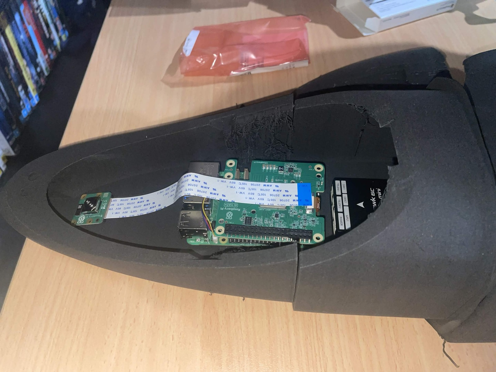
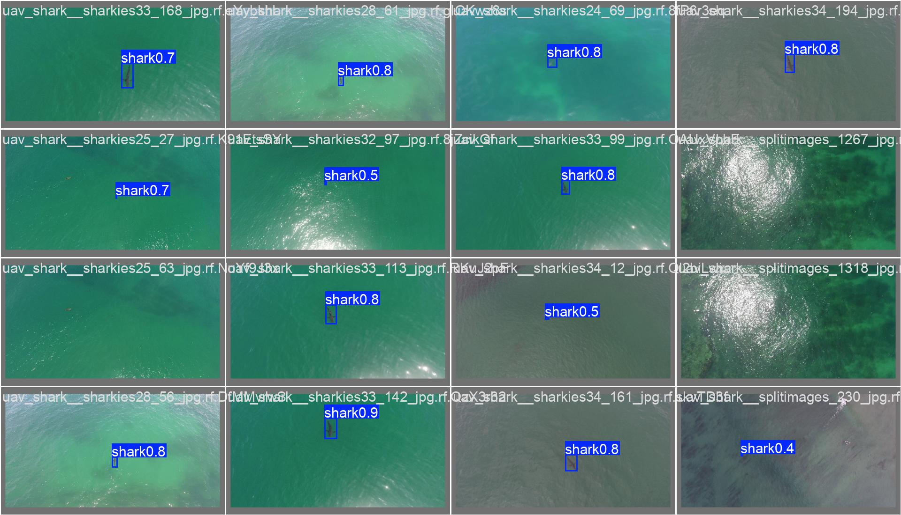
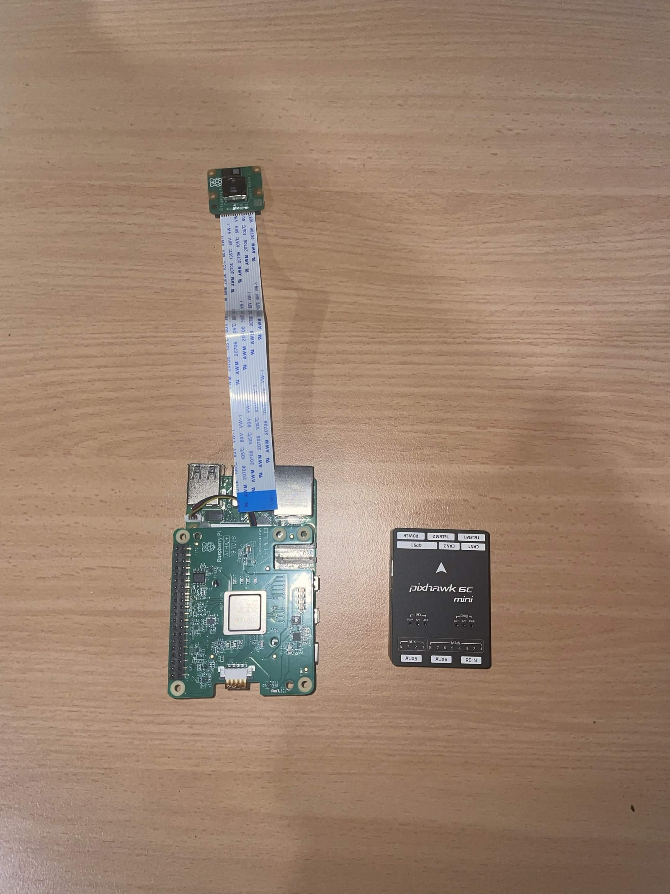
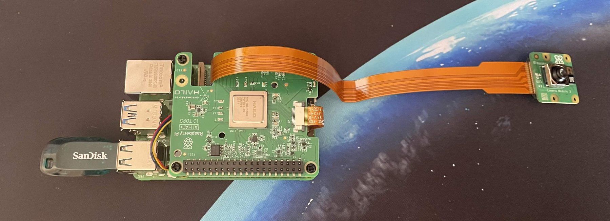

# Shark-ISR VTOL — Detection-Gated Guidance Autonomy

> **The aircraft transitions SEARCH → TRACK on its own.**
> A ROS 2 guidance state machine flies a tiltrotor VTOL, gated on onboard detection
> confidence. Replacing the need for an operator constantly watching the drone's camera transmission screen.
> The application is shark monitoring; the engineering is persistent ISR autonomy.



*Raspberry Pi 5 + AI HAT+ (Hailo-8L) + Camera Module 3 + Pixhawk 6C Mini, installed inside the
Titan Dynamics Hornet fuselage. Camera faces down through the nose aperture.*

---

## The contribution

Small drones can already fly search patterns. The gap this project targets is the **decision**:

**01 — Persistent coverage**
The swim zone is covered by a belief-weighted persistent patrol with a hard revisit bound, so no
water goes stale. Probability re-grows as a target could move in, so guidance returns instead of
chasing one greedy peak. Coverage, not a one-shot find. Implemented and unit-tested (ADR-012);
SITL-verified with the patrol strategy as the default (T10, 2026-09-03). *Honest status: the
shoreline-strip search area and threat weighting are wired and unit-tested (ADR-018) but every
SITL run so far uses a circular area — the strip itself has not been flown, even in sim.*

**02 — Confidence-gated transition**
Detections accumulate confidence across frames and decay on misses. Only a sustained crossing of
threshold τ triggers the autonomous SEARCH → TRACK transition and orbit-on-detect. One lucky frame
never flies the aircraft. Implemented in guidance (ADR-016), unit-tested, and SITL-verified in
both directions (T10: a 5-frame burst does not transition, a 30-frame stream does; T11: the real
mock-detector chain drives the transition with no test-side injection — 2026-09-03).

**03 — Onboard, link-independent**
The detector (YOLOv8n compiled to a Hailo `.hef`) is built to run on a 13-TOPS NPU on the
aircraft, so losing every radio link costs situational awareness — never autonomy. *Deployment
status: the `.hef` is compiled and the HailoRT load path is written, but the output decoder
(DFL + NMS) is not — `_hailo_forward` is a placeholder and `hef_path` is empty. Onboard inference
has never run. That is bench gate B08.*

---

## Architecture
<!-- -->
<!--```mermaid --> 
<!--flowchart LR
    subgraph CC["Companion — Raspberry Pi 5 · ROS 2"]
        PER[perception<br/>Cam3 → Hailo-8L → geo]
        GUI[guidance<br/>Bayes map · state machine]
        MIS[mission<br/>sequencing · arbitration]
        AP[autopilot<br/>sole PX4 boundary]
        TEL[telemetry<br/>logs · GCS relay] -->

        AP -->|vehicle_state| GUI
        AP -->|vehicle_state| MIS
        AP -->|vehicle_state| PER
        PER -->|detection| GUI
        GUI -->|guidance_setpoint| AP
        GUI -->|search_state| MIS
        MIS -->|AutopilotCommand srv| AP
        MIS -->|SetGuidanceMode srv| GUI
        PER & GUI & MIS -->|topics| TEL
    end
    AP <-->|uXRCE-DDS| PX4[PX4 — Pixhawk 6C Mini<br/>inner loop · tilt transition · failsafes]
```


**The responsibility boundary is the design.**

| Layer | Owns |
|---|---|
| **PX4** | Inner loop, the tilt transition, every failsafe. ROS 2 can only *ask*. |
| **ROS 2** | Mission, guidance, perception, telemetry. Seven interfaces (4 msg, 3 srv) — six frozen before any node was written, the seventh (`AutopilotCommand`) added in Phase 3 — frames + units explicit (ENU/FLU everywhere; all NED↔ENU conversion in one package). |

The companion computer is architecturally incapable of overriding a failsafe. Its total failure
degrades to an autopilot-handled failsafe (Position mode in SITL today; RTL once `COM_OBL_ACT` is set at hardware bring-up, gate B13).

---

## Detector

YOLOv8n fine-tuned on 3,261 aerial images from four Roboflow datasets, compiled to a Hailo `.hef`
for the onboard 13-TOPS NPU. Performance scored on **223 held-out images the model never saw**,
including 51 open-water hard negatives.

| Metric | Score | Condition | Source |
|---|---|---|---|
| mAP50 | **0.945** | Held-out test set | [`val-2/BoxPR_curve.png`](training/runs/detect/val-2/BoxPR_curve.png) |
| mAP50-95 | **0.742** | Held-out test set | eval console output not committed |
| Recall | **95%** | Held-out test set | eval console output not committed |
| Precision | **89%** | Held-out test set (incl. the 51 negatives) | eval console output not committed |

> **Provenance, stated plainly.** Only mAP50 has a committed artifact — the PR curve legend reads
> `all classes 0.945 mAP@0.5`. The other three come from the same `yolo val` run, whose console
> output was not saved; treat them as unverified until that run is repeated and its output
> committed. All four are **FP32 PyTorch** figures. The deployed `.hef` is INT8-quantised
> (64-image calibration) and its post-quantisation accuracy has not been measured.

**Recall is the mission metric.** For persistent aerial ISR, missing a detection is the
operational failure — the shark goes unlogged, the patrol wasted. 95% recall means the system
finds 19 of every 20 real targets. An 89% precision rate means ~1-in-9 detections is a false
positive; in ISR the cost is a second orbit — minor, recoverable.


*Model predictions on held-out validation frames. Sharks correctly flagged at 0.4–0.9 confidence;
open-water and reef patches correctly ignored.*

### Why this number is honest

The initial pipeline reported mAP50 **0.987** — a number that failed a plausibility check.
Investigation found the merge script had pooled source-level train and val sets, shuffled, and
re-split 90/10, scattering Roboflow augmentation siblings across both sides. ~67% of the val set
shared a source image with train. The merge pipeline was rewritten with a **group-disjoint split**
(siblings and video clips grouped by source, entire groups on one side only) and a held-out test
split added alongside open-water negatives. The model was retrained from scratch. Val ≈ Test
(0.949 vs 0.945) confirms it generalises.

### Compile pipeline

`.pt` → `.onnx` (opset 11, fixed batch) → `.har` (Hailo parse) → INT8 (64-img calibration) → **`.hef`**  
9 MB · hailo8l arch · 3-context · 0.45 threshold · 640 px · 10 Hz target

*DFL decode + NMS are **planned** for the Pi 5 CPU — neither is implemented yet. The `.hef` cuts at
six raw Conv end-nodes, so the postprocess has to be written before real-mode detections exist.
On-device bring-up (Hailo hardware in the loop) is bench gate B08; throughput unmeasured until then.*

---

## Hardware stack


*The four boards. Camera → Hailo-8L NPU → Raspberry Pi 5 companion → Pixhawk 6C Mini autopilot
(uXRCE-DDS). Mass and power budget against the 2.5 kg MTOW ceiling is an open task (B01) — the
boards have not been weighed.*


*The companion assembled and bench-verified (B07a, 2026-08-10): AI HAT+ seated on the Pi 5 over
PCIe, Camera Module 3 on the CSI ribbon. `hailortcli fw-control identify` reports Hailo-8 /
HAILO8L firmware 4.20.0; `rpicam-hello --list-cameras` reports imx708. Booting from the USB stick
rather than a microSD — the original cards turned out to be counterfeit (see
`docs/HARDWARE_BRINGUP.md` B07).*

| Board | Role |
|---|---|
| Raspberry Pi 5 | Companion computer — runs ROS 2, hosts all autonomy nodes |
| AI HAT+ (Hailo-8L, 13 TOPS) | Target host for the compiled `.hef` detector, ≤ 10 Hz — unmeasured (B08) |
| Camera Module 3 | Downward-facing, libcamera/picamera2 pipeline |
| Pixhawk 6C Mini | Autopilot — PX4, owns inner loop + failsafes |

---

## Status

| Phase | Scope | State |
|---|---|---|
| 1 | Interface contract — 6 interfaces frozen (7th, `AutopilotCommand`, added Phase 3) | ✅ Frozen 2026-05-31 |
| 2 | PX4 SITL + Gazebo coastal world + DDS bridge | 🔶 World + launcher done; DDS gate pending |
| 3 | Autopilot bridge (sole PX4 boundary, uXRCE-DDS) | ✅ SITL ✓ — T06 orbit · T07 failsafe (logs committed) |
| 4 | Guidance — Bayesian map, search, orbit-on-detect | ✅ SITL ✓ — T10 search + track transition (logs committed); strip area unit-tested only |
| 5 | Perception — Cam3 → Hailo detector → geolocation | 🔶 SITL ✓ for the **mock** chain (T11, logs committed); Hailo path unverified |
| 6 | Mission — state machine, failsafes | ✅ SITL ✓ — T08 abort · T09 battery · T10 e2e (logs committed) |
| 7 | Telemetry — JSONL logs, GCS relay | 🔶 Code complete; SITL rehearsal pending |
| 8 | Hardware bring-up, mass/power budget, flight test | ⬜ Planned (post-budget) |

All seven packages build green (`colcon` 8/8 on ROS 2 Humble). **80/80 unit tests pass**
(10 autopilot · 50 guidance · 12 perception · 8 mission). `telemetry_node` has no unit tests —
it is covered only by the SITL campaign.
A full-stack code review (ADR-011) caught and fixed 2 safety-critical + 6 high-severity bugs
before any sim run — validating the SITL-first rule.

---

## SITL verification

SITL runs the real ROS 2 nodes against a simulated PX4 autopilot and Gazebo Harmonic world.
It is the project's release gate: **no code reaches the aircraft until it has passed in SITL.**
T01–T05 (DDS bridge, arming, takeoff, loiter) passed in a prior campaign; T01–T05 figures remain
transcribed claims (no committed output). T06–T11 cover the full mission stack and were **all
re-run 2026-09-03** against the current code — the confidence gate (ADR-016) and the
persistent-patrol default (ADR-012/018) — in two sessions the same day: T10/T11 first, then
T06–T09. All six pass; console output for all six is committed.

| Test | Proves | Evidence |
|---|---|---|
| **T06** — Orbit geometry | Bridge holds a precise 30 m circular orbit | 20/20 setpoints on circle, min=max=mean=30.00 m |
| **T07** — Companion failsafe | If companion stops streaming, PX4 leaves Offboard on its own. What it does next is `COM_OBL_ACT` (unset in SITL → Position mode); RTL on hardware is gate B13 | Offboard loss → PX4 exits OFFBOARD in 5.0 s (COM_OF_LOSS_T=5.0s) |
| **T08** — Operator abort | Operator can abort; aircraft returns home under autopilot | CMD_ABORT drove PX4 to nav_state=5 (RTL) |
| **T09** — Low-battery failsafe | Low battery auto-triggers return before aircraft is stranded | Threshold crossing → guidance PHASE_RETURN (tuneable live via ROS 2 param) |
| **T10** — End-to-end mission | Full state machine runs start-to-finish without intervention; confidence gate holds on a 5-frame burst and fires on a 30-frame stream | IDLE→SEARCH→TRACK→RETURN in 14.6 s, gate held ✓ then fired ✓. TRANSIT is not observed at the 2 Hz state rate because the search centre is SITL home — arrival is immediate |
| **T11** — Perception → TRACK | The real *node* chain makes the SEARCH→TRACK decision itself, with no test-side injection | mock_camera_node → detector_node (sim mode) → /detection → guidance TRACK in 6.4 s; 45 detections received, `geo_valid=True` via the `/camera/camera_info` intrinsics path. **No real camera or Hailo inference is in this loop.** |

> **Evidence provenance.** T06–T11 figures are all from console output committed in
> `docs/sitl_runs/2026-09-03-t10-t11.md` (T10, T11) and `docs/sitl_runs/2026-09-03-t06-t09.md`
> (T06–T09). T01–T05 have no committed output yet — treat those as claims until re-run and
> committed the same way. A real (non-circular) search area has never been exercised in SITL —
> every run above uses the default circular area.
>
> **One SITL-environment finding surfaced running T09** (not a code defect): after T08's RTL, the
> landing detector didn't auto-disarm within several minutes even though the aircraft had
> touched down — `mission_node`'s RETURNING→IDLE transition (which waits on disarm) blocked until
> disarmed manually via the existing `AutopilotCommand.CMD_DISARM` service. Worth checking on
> real hardware before assuming RTL is a fully hands-off recovery.

```bash
./sim/tests/run_tests.sh          # PX4 SITL + Gazebo Harmonic + ROS 2 Humble
```

---

## Repo map

| Path | What |
|---|---|
| `ros2_ws/` | ROS 2 workspace — 7 packages, builds green (colcon 8/8 on Humble) |
| `ros2_ws/src/shark_isr_interfaces/` | 4 msg + 3 srv — the interface contract |
| `ros2_ws/src/shark_isr_autopilot/` | Sole PX4 boundary (uXRCE-DDS); NED↔ENU here only |
| `ros2_ws/src/shark_isr_perception/` | Cam3 → Hailo-8L → geolocation node |
| `ros2_ws/src/shark_isr_guidance/` | Bayesian map + search pattern + orbit-on-detect |
| `ros2_ws/src/shark_isr_mission/` | State machine, failsafe arbitration |
| `ros2_ws/src/shark_isr_telemetry/` | JSONL logging + GCS relay |
| `ros2_ws/src/shark_isr_bringup/` | Single-file stack launcher (`sitl.launch.py`) |
| `sim/tests/` | SITL test suite (T01–T11); run via `run_tests.sh` |
| `training/` | YOLOv8n pipeline — download → merge → train → ONNX → Hailo `.hef` |
| `training/runs/detect/` | Training artifacts: curves, confusion matrix, detection previews |
| `docs/` | Architecture, decisions (ADR-001–018), build plan, platform reference |
| `docs/sitl_runs/` | Committed SITL console output, one file per session |

---

## Engineering principles

1. One ROS 2 package = one responsibility; modules talk only through `shark_isr_interfaces`.
2. Energy is the binding resource — MTOW 2.5 kg hard ceiling, best-L/D loiter bias.
3. Frames + units explicit on every message; parameters in YAML, never hardcoded.
4. Everything logged — flight, detections, decisions — so any incident is reconstructable.
5. No code reaches the aircraft until it has passed in SITL.
6. The companion computer is never in the safety-critical loop.

---

## Platform

Titan Dynamics Hornet, 1.1 m tri-tiltrotor VTOL (3D-printed LW-PLA). Vendor manual figures cited
in `docs/HORNET_PLATFORM.md` — the manual itself is not redistributed here (vendor copyright);
available from [Titan Dynamics](https://www.titandynamics.org/3dhangar/p/titan-hornet-vtol).

---

## Author

**Ryan H.** — Electrical & Aerospace Engineering, QUT (Nov 2026)

[GitHub](https://github.com/RyanH281-UAV) · [LinkedIn](https://www.linkedin.com/in/ryan-hughes-b272873a9/)

<sub>MIT licensed (code & original docs). No flight data is presented as real prior to flight test.</sub>
