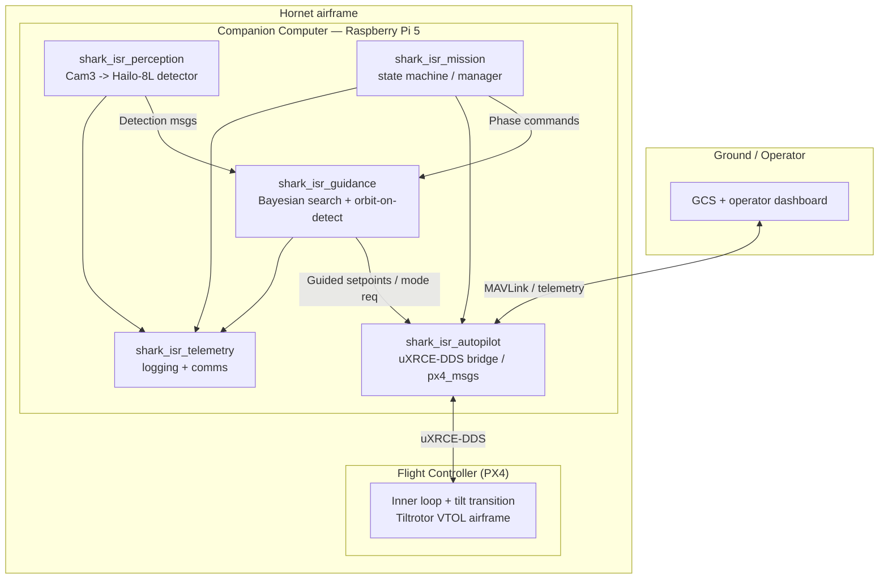

# Architecture

## System view

## Responsibility boundary

| Layer | Owner | Responsibility |
| --- | --- | --- |
| Inner loop, attitude, **tilt transition** | PX4 firmware | Stabilise, execute hover↔cruise, handle failsafes/RTL |
| Outer loop guidance | `shark_isr_guidance` | Search pattern, detection-triggered orbit/loiter, setpoint generation |
| Perception | `shark_isr_perception` | Cam3 → Hailo-8L `.hef` detector (onboard); publish geolocated detections |
| Mission management | `shark_isr_mission` | Phase sequencing (transit → search → track → return), arbitration |
| Autopilot I/O | `shark_isr_autopilot` | One package talks to PX4 (uXRCE-DDS + px4_msgs; MAVLink fallback) |
| Telemetry / logging | `shark_isr_telemetry` | Record everything; relay summaries to GCS |

## Dataflow contract (define these first)

The custom interfaces in `shark_isr_interfaces` are the spine of the system. Lock them early so
modules can be built independently:

- `Detection.msg` — class, confidence, image-frame bbox, geolocated lat/lon, timestamp.
- `SearchState.msg` — current phase, probability-map summary, coverage, time-on-station.
- `GuidanceSetpoint.msg` — target position/velocity or orbit centre+radius, in a documented frame.
- `MissionCommand.srv` / action — start/stop/return, parameters.

## Modularity & expansion rules

1. **One responsibility per package.** A new capability = a new package, not a new branch inside an
   existing node.
2. **Talk through interfaces, not internals.** Modules depend on `shark_isr_interfaces`, never on
   each other's implementation.
3. **The autopilot is behind one package.** PX4 via uXRCE-DDS lives only in `shark_isr_autopilot`;
   swapping firmware touches only that package and `config/`.
4. **Sim parity.** Anything runnable on hardware must run in SITL first (`sim/`). No untested code to
   the aircraft.
5. **Every package has a README** that states purpose, inputs, outputs, params, and how to run it in
   isolation.
